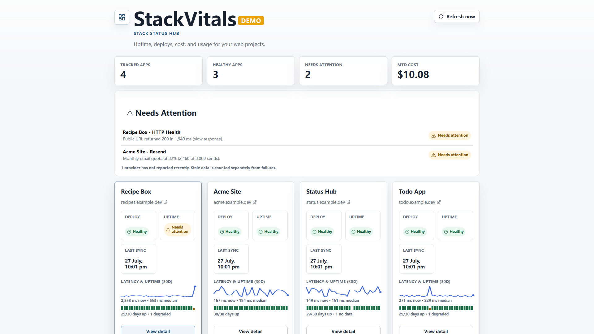
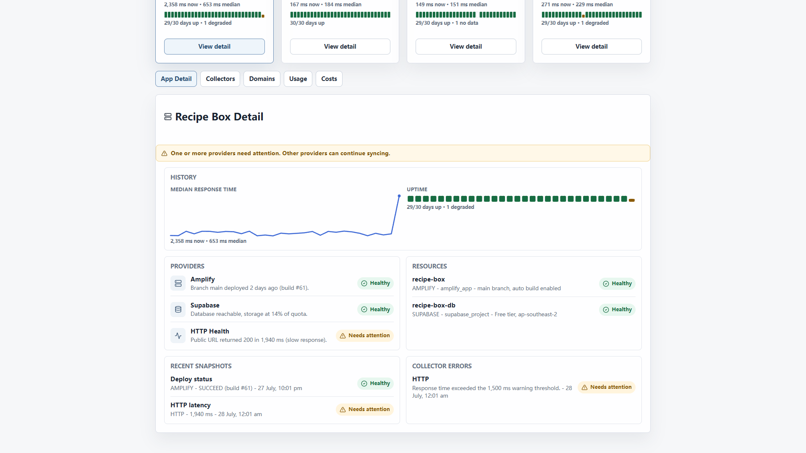
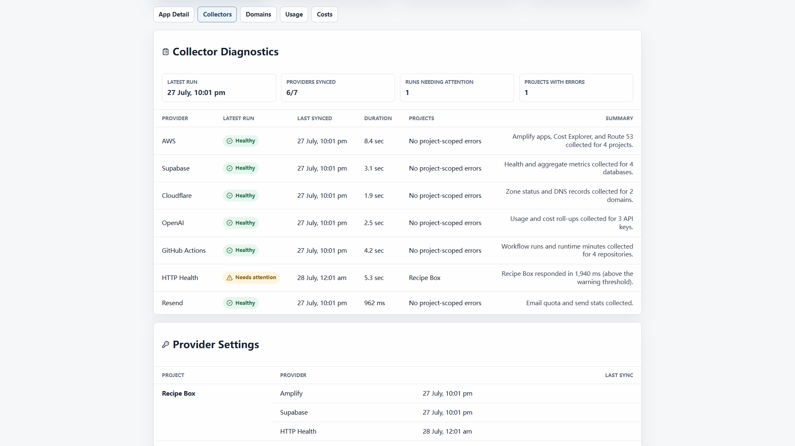
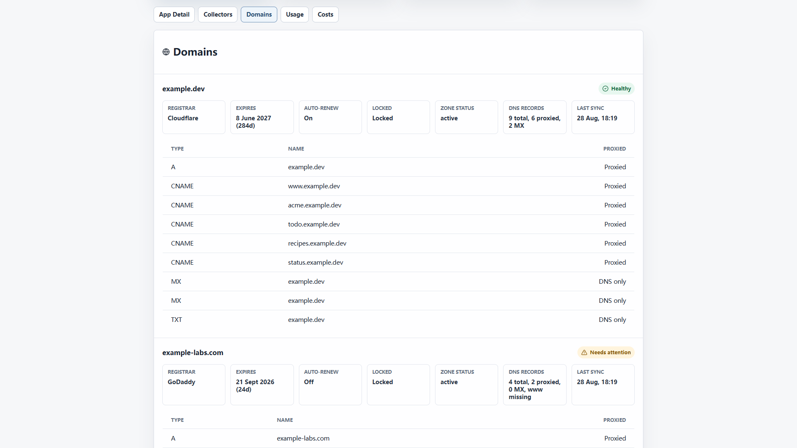
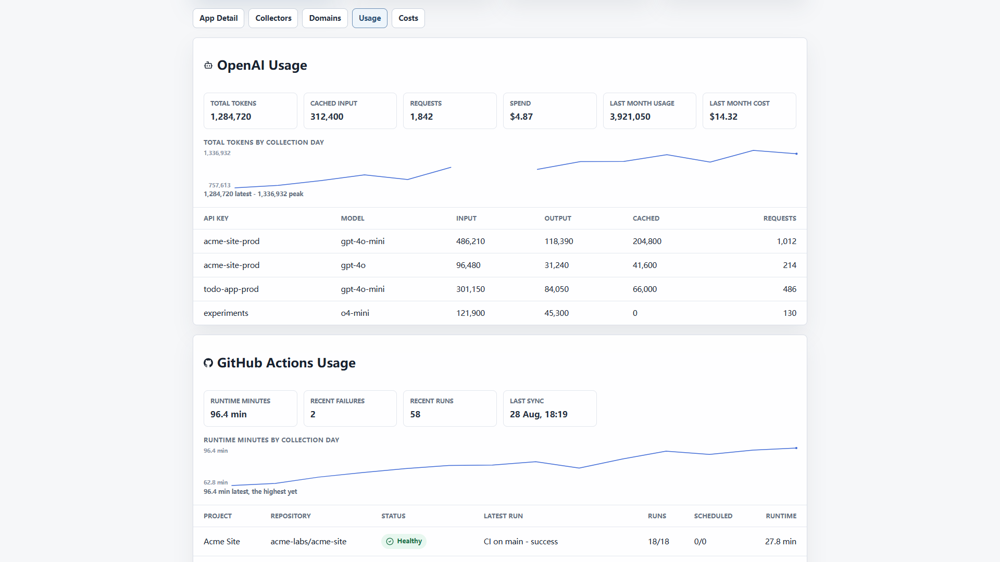
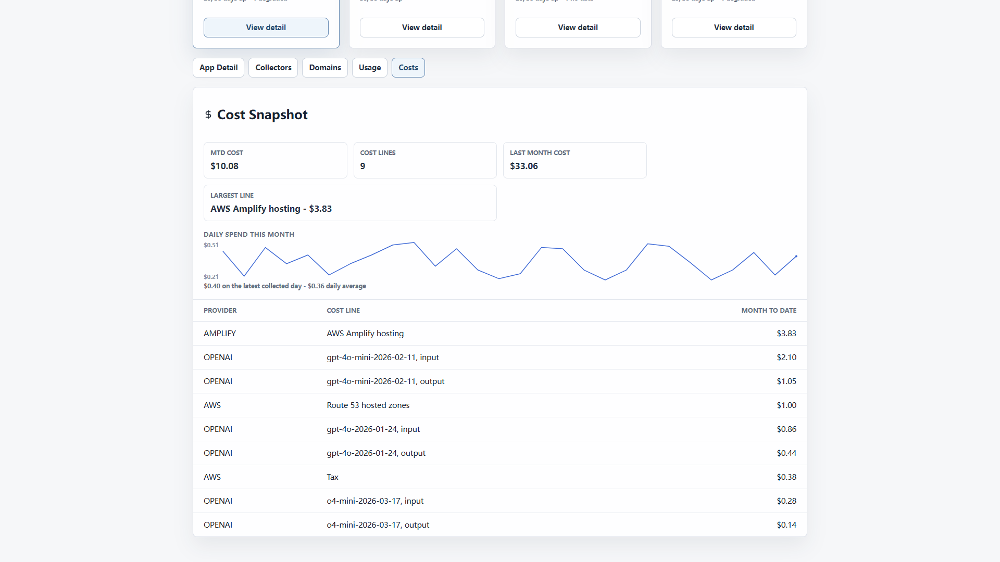

# StackVitals

**Stack Status Hub** for solo developers.

[](https://github.com/SteveWang92/stackvitals/actions/workflows/ci.yml)
[](https://github.com/SteveWang92/stackvitals/actions/workflows/deploy-site.yml)

Uptime, deploy status, cloud cost, and AI/CI usage for a handful of your own projects, in one
lightweight, self-hosted, single-database dashboard — built for a solo developer running a few
side projects who wants one page instead of five provider dashboards.

It reads pre-aggregated rows from your own Supabase project and never copies raw application
data out of the apps it watches — only counts, statuses, and costs.



<details>
<summary>More screenshots</summary>

| | |
|---|---|
|  |  |
|  |  |
|  | |

</details>

Screenshots are demo data (`npm run demo:screenshots`) — no real project or account is shown.

## What it tracks

Two moving parts, both in this repo:

- A **Vite + React + TypeScript** frontend that reads pre-aggregated rows from Supabase and
  renders them.
- A set of **Node collectors** that call external provider APIs and write snapshots back into
  the same Supabase project, on a schedule (GitHub Actions cron by default) — never in the
  browser.

Every collector is **opt-in**: it's only added to a run when its credentials are present, so you
turn on exactly the adapters you use.

| Adapter | Collects | Credentials | Minimum permissions |
|---|---|---|---|
| HTTP health | Public URL up/down, response time | none (just the project's public URL) | — |
| Amplify | Deploy status, branch, latest build | AWS access key/secret, region | Read-only Amplify access |
| AWS Cost Explorer | Account-level month-to-date / last-month cost per AWS service | AWS access key/secret, region | Read-only Cost Explorer access |
| Supabase project health | Reachability of the hub's own project or a watched app's | Supabase project URL + service-role key | Project-scoped service-role key |
| Watched-app Supabase aggregate | Count-only aggregate stats from a custom RPC you define in the watched app | That app's Supabase URL, anon key, service-role key, RPC name | Service-role key used only to call a count-only aggregate RPC — never raw table reads |
| Resend | Sending-domain verification status | Resend API key | Read-only API key |
| OpenAI usage | Token totals, request counts, cached-token counts, spend, by API key/model | OpenAI admin API key | Admin key (required by OpenAI's usage endpoints) |
| GitHub Actions | Workflow run counts, latest status, trigger type, branch, duration, scheduled-run health | Repo `owner/repo` mapping + read token (or the workflow's built-in token) | Actions: read |
| Cloudflare domains | Zone status, DNS record counts, apex/www/MX presence, registrar name + expiration when available | Cloudflare API token, optional account ID | Read-only token scoped to zones/DNS |

Full setup, including exact env var names and where each credential comes from, is in
[`docs/SELF_HOSTING.md`](docs/SELF_HOSTING.md).

## Quick start

```bash
git clone <your fork>
cd stackvitals
npm install
```

1. Create a Supabase project, apply everything in `supabase/migrations/`, then run
   `supabase/seed.sql`.
2. Copy `.env.example` to `.env` and fill in `VITE_SUPABASE_URL` / `VITE_SUPABASE_ANON_KEY` /
   `VITE_DASHBOARD_ALLOWED_EMAIL` (and `HUB_SUPABASE_JWT_SERVICE_ROLE_KEY` for the collector; it accepts a legacy service-role JWT or a new `sb_secret_` key).
3. Copy `projects.example.json` to `projects.config.json` and describe your own project(s) —
   at minimum a `slug`, `name`, and `publicUrl` gets you HTTP health monitoring with zero other
   credentials.
4. `npm run collect:status` — runs every adapter you've configured credentials for and writes
   results to Supabase.
5. `npm run dev` — open the dashboard.

That's the whole path from clone to a working dashboard tracking one HTTP-health project. Add
more adapters by adding more credentials — nothing else changes. See
[`docs/SELF_HOSTING.md`](docs/SELF_HOSTING.md) for the full walkthrough (local dev stack, prod
Supabase, deploying the frontend, scheduling the collector) and
[`CONTRIBUTING.md`](CONTRIBUTING.md) if you want to add a new provider adapter.

## Deploy

The frontend is a static Vite build — `npm run build` outputs `dist/`, which deploys the same
way to Amplify, Vercel, Netlify, or Cloudflare Pages. The collector is a plain Node script
(`npm run collect:status`); the committed `.github/workflows/collect.yml` runs it on a daily
cron and works on any fork as-is, or point any other scheduler that can run an `npm` script at
it instead.

## Single-owner by design

This isn't multi-tenant — it's built to be one dashboard for one person's projects. Access is
gated twice: the frontend checks the signed-in user's email against
`VITE_DASHBOARD_ALLOWED_EMAIL` (a comma-separated list) before rendering any data, and Supabase
RLS independently restricts reads to authenticated emails listed in `public.dashboard_users`.
To let a second person in (a co-maintainer, for example), add their email to both places — see
[`docs/SELF_HOSTING.md`](docs/SELF_HOSTING.md) for the exact steps.

## Docs

- [`docs/STACKVITALS_PLAN.md`](docs/STACKVITALS_PLAN.md) — record of product scope,
  architecture, and data-safety decisions.
- [`docs/SELF_HOSTING.md`](docs/SELF_HOSTING.md) — full deploy walkthrough and collector setup.
- [`CONTRIBUTING.md`](CONTRIBUTING.md) — adding a provider adapter, repo conventions.

## License

[AGPL-3.0-only](LICENSE). If you run a modified version of this dashboard as a network service,
the AGPL requires offering your users access to that version's source — see the `LICENSE` file
for the full terms.

## Verification

```bash
npm test
npm run lint
npm run build
```
